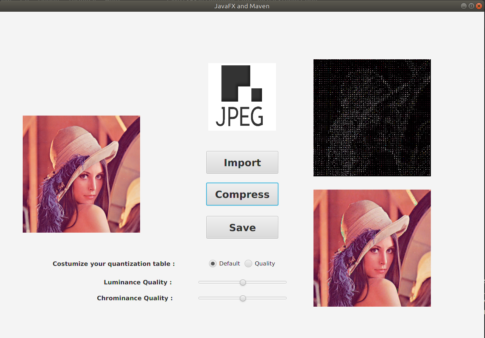
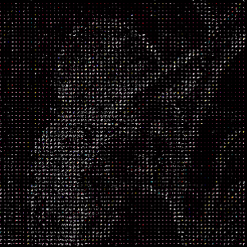
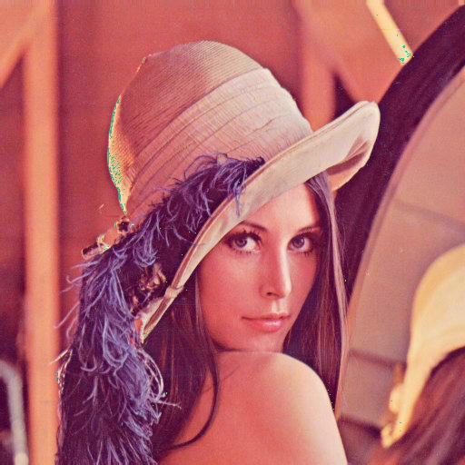
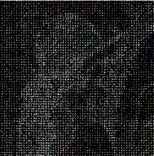
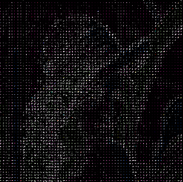
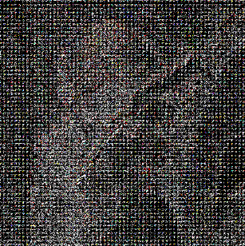

<head>
<link rel="stylesheet" type="text/css" href="css/figure.css">
</head>

## Jpeg Encoder And Decoder

[TOC]

#### UI : JavaFX

We are using JavaFX 11 (OpenFX) as our GUI framework. JavaFX is a light weight , new generation Java GUI framework in order to replace Swing. We use FXML files to define the layouts, and a ```FXMLController.java``` to ```control``` 

##### Layout



###### Image view

There are three ImageView in total. One the left, it is the original picture imported by user. On the right, the top one is the DCT result transforming into RBG image and the bottom one is the result of compressing and extracting the imported image. 

###### Button and Slider

The three buttons are the interfaces to import original image, compress image, and save result image. 
The radio button selects the mode for quantization. The default mode uses the luminance and chrominance quantization table on the text book. The 'Quality' mode applys the sliders to change the value of quantization table.
When sliding the slider to the left, the quantization table's values are getting smaller and with better compression quality. On the contrary, they are getting larger and with worse compression quality.
The top slider is to control the quantization for luminance, while the bottom one is for chrominance.


#### MVC Hierarchy

This project is using **MVC** design pattern. 

##### View Layer

The ```view``` layer is defined in FXML files, in our case, the file ```~/resources/fxml/Scene.fxml```, part of the fxml is written using a (TODO : the GUI interface Jason used here ), every element is instantiated either through a child label or an attribute. And the element have ```id``` values which can be accessed in the ``` controller``` module. For event systems, JavaFX use ```onAction``` attribute to notify corresponding method in the ```controller```. The view layer is decoupled from the ```controll layer```

##### Controller Layer

The ```FXMLController.java``` can have access to the FXML file elements, using ```@FXML``` annotation. We have ```handleButtonAction()``` callback methods listening on a FXML elment, like operations **import, compress, save, quality select, luminations select**. And ```controller``` are also responsible for create, manage, modify , I/O of```model``` instances.

##### Model Layer

```model``` is the core components of this application. We defined a ```class JpegModelObservable``` as our main model, and as its name suggests, it can be listened by a ```controller```, so the ```model``` is decoupled from ```view``` in our case. The ```JpegModelObservable``` maintains some data structures used for transformations of a image.  This model has member methods doing the actual work of tranformations including *color model conversion, 4:2:0 subsampling, DCT, quantization*,  each intermediate operation has a specific data structure storing information, which will be discussed in next chapter. Theoretically, each transformation would call the ```notify()``` method to the listeners, but this will cost too much computing resources, thus make the application extremely slow, so we only notify when everything is done ( except for the  matrix after DCT used for displaying our algorithm correctness) .  The design is quite simple.

#### Data Structures

Data structure are the key part understanding our work. Instead of using third-party libraries, we defined our own data structures, and used the most simple (but slow) implementation of matrix multiplication. Considering that we are not so scientific , we don't need a high speed processing images. The loss of speed is completely acceptable.

##### YuvColor 

This class has 3 integer array, storing Y, U ,V pixels respectively. Notice they are all one dimension arrays, and can be created using 1 pixel value array. This class has ```subsampling()``` and do the 4:2:0 YCrCb subsampling. It also support paddling if the width or height is not multiples of 8.

##### Matrix8f

A 8 * 8 double float matrix data structure, it supports matrix multiplication, matrix copy, matrix add, matrix multiply a scalar, elementwise division (for quantization). Some basic matrix are derived from this class, like the transform matrix used in DCT, the quantization matrix for each 8 * 8 block. 

##### TransformMatrix

A subclass of **Matrix8f** singleton, it has a ```transpose()``` which return the transpose matrix of the DCT transform Matrix. It is immutable.

##### QuantizationMatrix

Given a quality number from 0 ~ 2, it can generate a quantization matrix of 8 * 8. Also a subclass of **Matrix8f**.  It used in the quantization steps.

##### BufferedImage

A java built-in image representation, we save the data after quantization to a file, then read it , do the reverse processing, then we get a RGB map (1-d array), then we can use this 1-d array to feed the BufferedImage to display on our JavaFX GUI. Our application has 3 picture in total, the initial picture, the picture after compression, the DCT matrix represented as RGB value output.

#### Algorithms : Encoder

In this chapter we are going through some basic implementations of the Jpeg Compression Process.

##### step1ColorTransform

First when we create a ```JpegModelObservable``` instance , we get a BufferImage instance of the file we want. Then we transfrom the BufferedImage to a pixel 1-d array. Next we fill the YuvColor instance using this pixel 1-d array. So far we've done the color transformation.

##### step2Subsampling

The 4:2:0 subsampling is a little bit harder to understand at first. What subsampling means : for three 4 width, 2 height block, one such 4 * 2 block for a chroma (Y, U, V). For the Y block, we make them stay the same. for U block, we set the first square block ((0,0) to (1,1)) all the same U value of the first pixel (0,0)'s U value and the same V value of (1,0)'s V value. And we set the second square block ((2, 0) to (3, 1)) all the same U value of the first pixel (2,0)'s U value and the same Y value of (2,1)'s V value. Resulting in U, V blocks, some adjacent pixel have the same value (and before subsampling they dont). This is the first place where information were lost.

##### step3DctAndQuantization

The Purpose of DCT, is to transform from color space to frequency space, and frequency space can store more information with certain loss. The trick is simple, divide the whole picture to 8 * 8 matrix, for every Y, U V values (range from 0 ~ 255) we minus then with 128, then apply the DCT transformation, get the dct matrix. However in the low frequency area there are a lot of values close to 0 but no zero. In order to get more zeros so we can encode them later using cross entropy coding, we use quantization matrix to round the elements in the matrix to a nearest integer (to generate more 0s in low frequency). Since human eyes are not sensitive to low frequency areas, so loss in low frequency areas is totally acceptable. Quantization is the second place where we lost information.

So far our encoder has completed. The data structure we obtained is not a standart Jpeg file format. But it can be understand by the decoder we are going to talk about in next chapter.

#### Algorithms : Decoder

In this chapter we are going through the Jpeg decoding Process without Entropy Coding. The decoding process is similar to the encoding process but in reverse order.

##### step4ShowDctImage

In order to display the DCT matrixes after DCT and quantization, we regard the three DCT matrixes of Y, U, and V channel as a YUV image. And then we transform it into a RGB image and display it on the home page of our program. Although the transformed image does not have specific meaning, we can see the Y DCT values by the luminance of that image and the U,V DCT values by its chrominance.

##### step5ExtractJpeg

Since we did not implement the entropy encoding and decoding part, we directly multiply the previous DCT matrix by the same quantization table in the compression process. After that, we perform the reverse DCT by multiplying the inverse matrix of that in the compression process. Now we get the YUV image after Jpeg compression and extraction, and then we transform the YUV image into result RGB image and display it on the home page.  

#### Examples

##### Default mode

We first apply default mode to see the performance of the result image after encoding and decoding. The DCT image can also help us to have a general sense of its DCT matrixes values. Here are the results:

<figure style="width:30%">
    
    <figcaption>1. Original Image</figcaption>
</figure>
    
<figure style="width:30%">
    
    <figcaption>2. DCT Image</figcaption>
</figure>

<figure style="width:30%">
    
    <figcaption>3. Result Image</figcaption>
</figure>


We can see that the result image has some green blocks at the border of hat and hair. It illustrates that the compression may lose more information at the border of different segments than within the segment.

##### Quality

In 'Quality' mode, we can use the slider to control the values in the quatization table so as to control the compress quality on both luminance and chrominance channel. First we slide the luminance slider to the left and obtain a high quality luminance quantization table. From figure 5, the DCT image is much lighter than the default one, which shows that it has larger values after quantization. Therefore, figure 4 has less green blocks and the luminance quality is better than the default result. 
When we slide the chrominance slider to the right, we obtain a chrominance quantization table with larger values, which means that it may lose more chrominance information. From figure 6, there are more green blocks than the default result.

<figure style="width:23%">
    
    <figcaption>4. High Lum Result</figcaption>
</figure>
    
<figure style="width:23%">
    
    <figcaption>5. High Lum DCT</figcaption>
</figure>

<figure style="width:23%">
    
    <figcaption>6. Low Chrom Result</figcaption>
</figure>

<figure style="width:23%">
    
    <figcaption>7. Low Chrom DCT</figcaption>
</figure>

At last we apply both luminance and chrominance quantization table with small values to obtain a best quality image. We can see that the figure 7 is nearly the same with the original image. The DCT image is very light and colorful, which shows that it lose less information on both luminance and chrominance. 

<figure style="width:45%">
    
    <figcaption>8. Best Result</figcaption>
</figure>

<figure style="width:45%">
    
    <figcaption>9. Best DCT</figcaption>
</figure>

#### References


